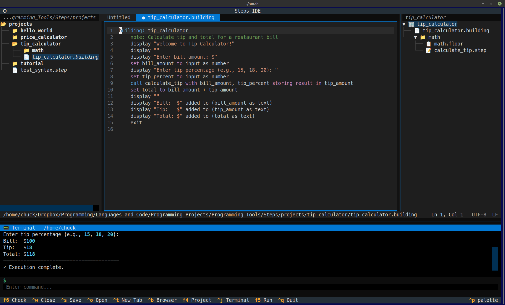

# Steps Programming Language

[](https://www.python.org/downloads/)
[](tests/)
[](LICENSE)



> **An educational programming language that makes program structure visible and mandatory.**

Steps teaches programming through an architectural metaphor, enforcing decomposition and clear structure from day one.

---

## 🏗️ The Building Metaphor

Steps uses architecture to make program structure explicit and visible:

| Construct | Purpose | File Extension |
|-----------|---------|----------------|
| **Building** | Complete program (entry point) | `.building` |
| **Floor** | Functional grouping of related steps | `.floor` |
| **Step** | Single unit of work (one file per step) | `.step` |
| **Riser** | Private helper function within a step | (inside .step) |

This hierarchy enforces decomposition - you can't write monolithic code in Steps!

---

## 📦 Installation

### From Source

```bash
# Clone the repository
git clone <repository-url>
cd Steps

# Create virtual environment
python3 -m venv venv
source venv/bin/activate  # or venv\Scripts\activate on Windows

# Install in development mode
pip install -e ".[dev]"

# Install IDE dependencies
pip install textual watchfiles
```

---

## 🚀 Quick Start

### 1. Create a Simple Program

Create a project folder with a `.building` file:

```
hello_world/
└── hello_world.building
```

In `hello_world.building`:
```steps
building: hello_world
    display "Hello, World!"
    exit
```

### 2. Run Your Program

```bash
python -m steps.main run hello_world/
```

### 3. Or Use the Interactive REPL

```bash
python -m steps_repl.main
```

```
Steps REPL v0.1 - Educational Programming Environment
Type 'help' for available commands, 'exit' to quit.

>>> set greeting to "Hello, Steps!"
>>> display greeting
Hello, Steps!
>>> vars
Variables:
  greeting = "Hello, Steps!"
```

### 4. Launch the Steps IDE

```bash
python -m steps_ide.main
```

The IDE provides a full development environment with:
- Project browser (Ctrl+Shift+P)
- Syntax-aware editor
- Run (F5) and Check (F6) commands
- Terminal output panel (Ctrl+J)

---

## 📚 A Complete Example

Here's a more complete program with floors and steps:

```
price_calculator/
├── price_calculator.building
└── calculations/
    ├── calculations.floor
    ├── calculate_subtotal.step
    └── apply_discount.step
```

**price_calculator.building:**
```steps
building: price_calculator
    note: Calculate the final price with discount

    declare:
        price as number
        quantity as number
        subtotal as number
        final_price as number

    do:
        display "Enter price: "
        set price to input as number

        display "Enter quantity: "
        set quantity to input as number

        call calculate_subtotal with price, quantity storing result in subtotal
        call apply_discount with subtotal, 10 storing result in final_price

        display "Final price: $" added to (final_price as text)
        exit
```

**calculations/calculations.floor:**
```steps
floor: calculations
    step: calculate_subtotal
    step: apply_discount
```

**calculations/calculate_subtotal.step:**
```steps
step: calculate_subtotal
    belongs to: calculations
    expects: price, quantity
    returns: total

    do:
        set total to price * quantity
        return total
```

**calculations/apply_discount.step:**
```steps
step: apply_discount
    belongs to: calculations
    expects: amount, percent
    returns: discounted

    declare:
        discount as number

    do:
        set discount to amount * (percent / 100)
        set discounted to amount - discount
        return discounted
```

---

## 🛠️ CLI Commands

| Command | Description |
|---------|-------------|
| `python -m steps.main run <path>` | Run a Steps project |
| `python -m steps.main check <path>` | Validate syntax without running |
| `python -m steps.main repl` | Start the interactive REPL |
| `python -m steps.main diagram <path>` | Generate ASCII flow diagram |
| `python -m steps_repl.main` | Start REPL directly |
| `python -m steps_ide.main` | Launch the Steps IDE |

---

## 📖 Documentation

| Document | Description |
|----------|-------------|
| [USER-GUIDE.md](USER-GUIDE.md) | Getting started guide for users |
| [LANGUAGE-REFERENCE.md](LANGUAGE-REFERENCE.md) | Complete language reference |
| [dev-docs/](dev-docs/) | Developer documentation |

### Developer Documentation (dev-docs/)

- `PROJECT_OVERVIEW.md` - High-level project orientation
- `LANGUAGE_SPEC.md` - Complete syntax and semantics
- `ARCHITECTURE.md` - Interpreter design
- `DEVELOPMENT_GUIDE.md` - Development workflow

---

## 🧪 Development

### Running Tests

```bash
# Run all tests
pytest

# Run with verbose output
pytest -v

# Run specific test file
pytest tests/unit/test_lexer.py
```

### With Coverage

```bash
pytest --cov=steps --cov-report=html
```

### Type Checking

```bash
mypy src/steps src/steps_repl --ignore-missing-imports
```

### Project Structure

```
Steps/
├── src/
│   ├── steps/           # Core interpreter
│   │   ├── lexer.py     # Tokenization
│   │   ├── parser.py    # AST construction
│   │   ├── interpreter.py  # Execution engine
│   │   ├── environment.py  # Scopes and registry
│   │   └── ...
│   ├── steps_repl/      # Interactive REPL
│   └── steps_ide/       # TUI-based IDE
├── tests/
│   ├── unit/            # Unit tests
│   └── integration/     # Integration tests
├── dev-docs/            # Developer documentation
└── README.md
```

---

## 🎯 Design Philosophy

1. **Visible Structure** - Program architecture is explicit, not hidden
2. **Mandatory Decomposition** - One step per file prevents monolithic code
3. **Conscious Engagement** - English-readable syntax requires understanding
4. **Clear Data Flow** - Explicit `expects`/`returns` declarations
5. **Educational Error Messages** - Errors teach, not frustrate

---

## 📄 License

MIT License

---

## 🤝 Contributing

Contributions are welcome! Please see `dev-docs/DEVELOPMENT_GUIDE.md` for guidelines.
